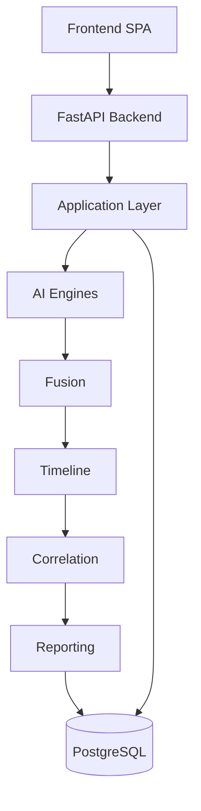
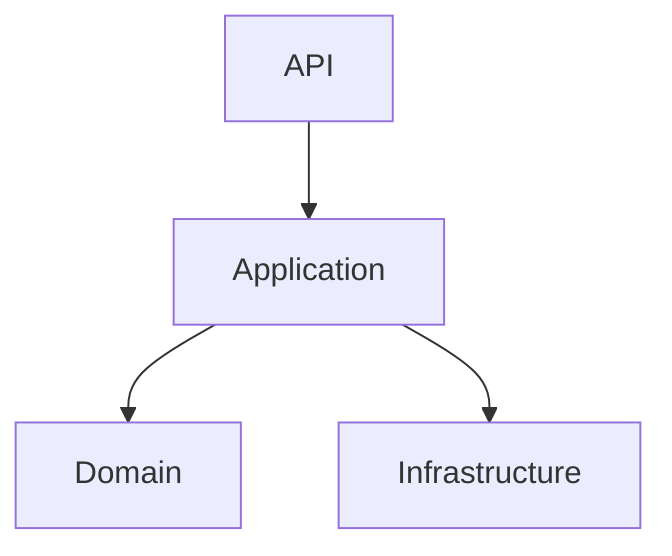
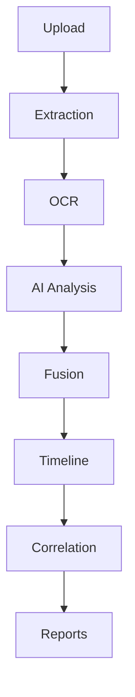
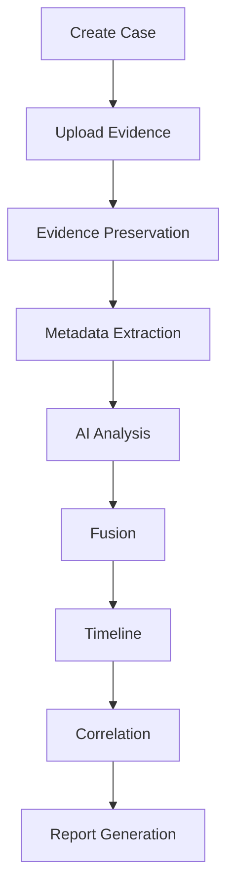

# AI_Forge

Enterprise Multimodal Digital Forensics & Fraud Intelligence Platform

AI_Forge helps digital forensic investigators and fraud analysts examine
multimodal evidence through **deterministic** processing and AI pipelines.
Findings are stored with provenance, hashed artifacts, and explicit
capability reporting. Original files remain immutable. The platform does
**not** invent legal conclusions; it produces investigative aids that can
be reviewed, explained, and exported.

Version **1.0.0** covers Phases 1–10 in this repository.

[](https://www.python.org/)
[](https://fastapi.tiangolo.com/)
[](https://react.dev/)
[](https://www.typescriptlang.org/)
[](https://www.postgresql.org/)
[](https://www.docker.com/)
[](LICENSE)

## Table of Contents

- [Features](#features)
- [Architecture](#architecture)
- [Technology Stack](#technology-stack)
- [Project Structure](#project-structure)
- [Investigation Workflow](#investigation-workflow)
- [Screenshots](#screenshots)
- [Installation](#installation)
- [Frontend](#frontend)
- [Running Tests](#running-tests)
- [API Documentation](#api-documentation)
- [Security](#security)
- [Documentation](#documentation)
- [Release Status](#release-status)
- [Roadmap](#roadmap)
- [Contributing](#contributing)
- [License](#license)

## Features

### Core Platform

| Capability | Description |
| --- | --- |
| Case management | Numbered cases, metadata, listing, and case-scoped work |
| Evidence management | Allow-listed upload, SHA-256 registration, retrieval |
| Chain of custody | Custody events tied to evidence lifecycle |
| Processing pipeline | Deterministic jobs and hashed derived artifacts |
| Metadata extraction | Document, image, audio, and video extractors |
| OCR | Optional Tesseract OCR when enabled and available |
| Timeline reconstruction | Case timeline from stored findings and events |
| Cross-evidence correlation | Deterministic correlation across a case |
| Reporting | Aggregated JSON content, PDF, and download |
| Explainability | Limitations, confidence notes, and provenance on reports |

### AI Modules

| Module | Description |
| --- | --- |
| Image analysis | Image AI forensic analysis pipeline |
| Video analysis | Video AI forensic analysis pipeline |
| Audio analysis | Audio AI forensic analysis pipeline |
| Document analysis | Document AI forensic analysis pipeline |
| Signature verification | Signature comparison against a reference |
| AI fusion | Deterministic multimodal fusion of stored findings |
| AI jury | Jury-style assessment produced by the fusion engine |

Outputs are investigative findings, not verdicts. Missing models or
optional tools (OCR, ffprobe) are reported rather than fabricated.

### Platform

- Versioned REST API under `/api/v1`
- JWT authentication (when `JWT_SECRET` is configured)
- Role-based access control (RBAC) and permission codes
- Audit logging of investigation-relevant actions
- Monitoring dashboards, metrics, and health/readiness probes
- Docker Compose, production images, and Kubernetes manifests
- OpenAPI (`/docs`, `/redoc`, `/openapi.json`) when `DEBUG=true`

## Architecture

### Overall system architecture



The API also uses Redis (cache and rate limiting), local or object
storage for originals and artifacts, and optional Celery workers behind
RabbitMQ. See [docs/architecture-overview.md](docs/architecture-overview.md).

### Clean Architecture



Dependencies point inward. Forensic and AI engines must not depend on
HTTP or UI layers.
[docs/backend-architecture.md](docs/backend-architecture.md)

### Processing pipeline



OCR runs only when configured (`OCR_ENABLED`) and Tesseract is present.
AI, fusion, timeline, correlation, and reporting consume **stored**
results; they do not silently re-execute earlier stages.

## Technology Stack

| Layer | Technology |
| --- | --- |
| Backend | Python 3.12, FastAPI, Uvicorn, Pydantic |
| Frontend | React 19, TypeScript, Vite, TanStack Query, Tailwind CSS |
| Database | PostgreSQL 16 (SQLite in automated tests) |
| ORM | SQLAlchemy 2 (async) + Alembic |
| Queue | Celery, RabbitMQ (optional worker mode) |
| Cache | Redis |
| Authentication | JWT (PyJWT), Argon2 password hashing, RBAC |
| Testing | pytest, pytest-asyncio, Ruff, MyPy, Vitest |
| Documentation | Markdown in `docs/`, OpenAPI when debug is enabled |
| Deployment | Docker, Compose, Nginx, Kubernetes manifests |

## Project Structure

```text
.
├── backend/
│   ├── alembic/                 # Migration chain
│   └── app/
│       ├── api/                 # FastAPI routers and schemas
│       ├── application/         # Use cases and processing
│       ├── domain/              # Domain models and ports
│       ├── infrastructure/      # Database, storage, cache
│       ├── ai/                  # Image, video, audio, document AI
│       ├── fusion/              # Multimodal fusion and jury
│       ├── timeline/            # Timeline engine
│       ├── correlation/         # Cross-evidence correlation
│       ├── reporting/           # Report aggregation and PDF
│       ├── monitoring/          # Metrics, tracing, health
│       ├── platform_validation/ # Platform validation checks
│       ├── auth/                # JWT, sessions, permissions
│       ├── audit/               # Audit recording and export
│       ├── extraction/          # Metadata and optional OCR
│       └── models/              # SQLAlchemy persistence
├── frontend/                    # Vite investigation workspace
├── docs/                        # Operator and investigator guides
├── deployment/                  # Docker, Compose, k8s, nginx
├── scripts/                     # Migrate, deploy, benchmarks
├── tests/                       # Backend pytest suite
├── samples/                     # Synthetic demo case and evidence
├── configs/                     # Logging configuration
├── docker-compose.yml
├── pyproject.toml
└── LICENSE
```

## Investigation Workflow



Preservation stores SHA-256 hashes and custody events. Later stages
read persisted findings. A synthetic walkthrough is in
[samples/workflow.md](samples/workflow.md).

## Screenshots

UI captures belong under `docs/images/` (do not commit real case data).
The following paths are the intended placeholders; they are **not**
embedded here.

| View | Path |
| --- | --- |
| Dashboard | `docs/images/dashboard.png` |
| Investigation workspace | `docs/images/investigation-workspace.png` |
| Evidence view | `docs/images/evidence-view.png` |
| Image analysis | `docs/images/image-analysis.png` |
| Document analysis | `docs/images/document-analysis.png` |
| Video analysis | `docs/images/video-analysis.png` |
| Audio analysis | `docs/images/audio-analysis.png` |
| Fusion AI | `docs/images/fusion-ai.png` |
| Timeline | `docs/images/timeline.png` |
| Correlation | `docs/images/correlation.png` |
| Reports | `docs/images/reports.png` |

## Installation

### Requirements

- Python 3.12
- [uv](https://docs.astral.sh/uv/)
- **Native PostgreSQL** (required for local API / migrations)
- Node.js 22 (frontend)
- Redis / RabbitMQ / Celery — **optional** for normal local development
- Docker — **optional** (production / Compose only; not required locally)

### Local Development — No Docker

Primary laptop workflow (Windows PowerShell). Docker Desktop is not needed.

1. Create the Python environment and install dependencies  
2. Install and start native PostgreSQL  
3. Create database/role `ai_forge`  
4. Configure `.env` from `.env.example` (uses `localhost`, not Compose hostnames)  
5. Run Alembic migrations  
6. Start FastAPI  
7. Start the React frontend  

```powershell
# From the repository root
copy .env.example .env
# Edit .env: set DATABASE_URL user/password to match your PostgreSQL install

uv sync --dev

# Create DB (example with psql; adjust for your install)
# psql -U postgres -c "CREATE USER ai_forge WITH PASSWORD 'ai_forge';"
# psql -U postgres -c "CREATE DATABASE ai_forge OWNER ai_forge;"

uv run alembic -c backend/alembic.ini upgrade head
uv run uvicorn backend.app.main:app --host 127.0.0.1 --port 8000 --reload
```

Helper (checks Postgres, migrates, starts API):

```powershell
.\scripts\dev.ps1
```

In a second terminal:

```powershell
cd frontend
npm install
npm run dev
```

- API: `http://127.0.0.1:8000`  
- UI: `http://localhost:5173` (Vite proxies `/api` → backend)  
- Liveness: `GET /api/v1/health/live`  
- Health: `GET /api/v1/health`  
- System info: `GET /api/v1/system/info`

**Local service matrix**

| Service | Local need |
| --- | --- |
| PostgreSQL | Required |
| FastAPI / Uvicorn | Required |
| React / Vite | Required for UI |
| Redis | Optional (rate-limit/cache; in-memory rate-limit fallback exists) |
| RabbitMQ + Celery worker | Optional (`JOB_QUEUE_MODE=local` is default — jobs run in-process) |

Set `JOB_QUEUE_MODE=celery` and run a worker only when you need distributed queues.
See [docs/scalability.md](docs/scalability.md).

### Docker Compose (optional / production-style)

Compose remains supported for CI and full-stack container runs. It is **not**
required for day-to-day local development.

```bash
docker compose up
```

Production-oriented Compose and images:
[docs/deployment-guide.md](docs/deployment-guide.md).

## Frontend

Node.js 22 is recommended. `frontend/.env.development` points
`VITE_BACKEND_URL` at `http://127.0.0.1:8000`. Details:
[docs/development.md](docs/development.md).

## Running Tests

### Backend

```bash
uv run ruff check .
uv run ruff format --check .
uv run mypy backend
uv run pytest
```

### Frontend

```bash
cd frontend
npm test
npm run build
```

`npm test` runs Vitest. `npm run build` type-checks and produces the
production bundle.

## API Documentation

When `DEBUG=true`:

| Resource | Path |
| --- | --- |
| Swagger UI | `/docs` |
| ReDoc | `/redoc` |
| OpenAPI schema | `/openapi.json` |

Those routes are disabled when `DEBUG=false` (production default).

Health (always available under the API prefix):

| Probe | Path |
| --- | --- |
| Health | `GET /api/v1/health` |
| Liveness | `GET /api/v1/health/live` |
| Readiness | `GET /api/v1/health/ready` |

Prometheus metrics: `GET /metrics` and `GET /api/v1/metrics` (restrict
at the edge in production). Endpoint catalog:
[docs/api-reference.md](docs/api-reference.md).

## Security

Implemented in v1.0:

- JWT access and refresh tokens when authentication is configured
- RBAC with server-side permission checks
- Burst and sustained rate limiting (Redis with in-memory fallback)
- Audit logs for investigation and administration events
- SHA-256 hashing of original evidence and derived artifacts
- Chain of custody records
- Request validation (Pydantic) and allow-listed uploads
- Path traversal and dangerous-extension rejection on upload
- Explainable reports: limitations and confidence notes, no silent
  fabrication of findings

Operational notes: [docs/security-rc3.md](docs/security-rc3.md),
[SECURITY.md](SECURITY.md).

## Documentation

Index: [docs/README.md](docs/README.md).

| Topic | Document |
| --- | --- |
| Architecture | [architecture-overview.md](docs/architecture-overview.md), [backend-architecture.md](docs/backend-architecture.md) |
| Processing pipeline | [processing-pipeline.md](docs/processing-pipeline.md) |
| Fusion | [fusion-ai.md](docs/fusion-ai.md) |
| Timeline | [timeline-engine.md](docs/timeline-engine.md) |
| Correlation | [correlation-engine.md](docs/correlation-engine.md) |
| Reporting | [forensic-reporting.md](docs/forensic-reporting.md), [reporting.md](docs/reporting.md) |
| Monitoring | [monitoring.md](docs/monitoring.md), [system-monitoring.md](docs/system-monitoring.md) |
| Deployment | [deployment-guide.md](docs/deployment-guide.md), [deployment.md](docs/deployment.md) |
| User / investigator | [user-guide.md](docs/user-guide.md) |
| Administrator | [administrator-guide.md](docs/administrator-guide.md) |
| Developer | [developer-guide.md](docs/developer-guide.md) |
| API reference | [api-reference.md](docs/api-reference.md) |
| Known limitations | [known-limitations.md](docs/known-limitations.md) |

## Release Status

| Item | Status |
| --- | --- |
| Current version | **v1.0.0** |
| Production ready | Yes, for labs that accept [known limitations](docs/known-limitations.md) |

Phases 1–10 delivered in this tree:

1. Foundation, configuration, health, and Clean Architecture
2. Persistence and storage boundaries
3. Cases, evidence, hashing, and custody
4. Processing and extraction (including optional OCR)
5. Classic forensics and comparison
6. Modality AI, fusion, case intelligence, and reporting
7. Timeline, correlation, entities, reports, audit, system
8. Authentication, collaboration, monitoring, workflow, security, deployment
9. Interoperability, knowledge graph, investigation intelligence, review
10. Production infrastructure, observability, performance, security,
    scale, disaster recovery, CI/CD, and documentation

Changelog: [CHANGELOG.md](CHANGELOG.md).  
Release notes: [RELEASE_NOTES.md](RELEASE_NOTES.md).

## Roadmap

### Version 2.0 ideas

The following are **not implemented** in v1.0. They are possible future
enhancements only:

- Natural-language investigator assistant
- Dedicated face-recognition identification workflows
- Additional cloud storage connectors
- Broader distributed processing topologies
- Multi-tenant SaaS isolation at large scale

Any future work must keep original evidence immutable and preserve
backward-compatible APIs unless a new major version says otherwise.
See [ROADMAP.md](ROADMAP.md).

## Contributing

Contributions should stay additive: no silent forensic algorithm
changes, no undocumented API or schema breaks, and no real evidence in
git.

1. Read [CODE_OF_CONDUCT.md](CODE_OF_CONDUCT.md) and
   [docs/contributing.md](docs/contributing.md).
2. Open an issue from `.github/ISSUE_TEMPLATE/`.
3. Branch from `main` (`feature/*` or `fix/*`).
4. Run the test commands in [Running Tests](#running-tests).
5. Submit a pull request using `.github/PULL_REQUEST_TEMPLATE.md`.

Security issues: [SECURITY.md](SECURITY.md).  
Developer map: [docs/developer-guide.md](docs/developer-guide.md).

## License

This project is licensed under the **MIT License**. See [LICENSE](LICENSE).
