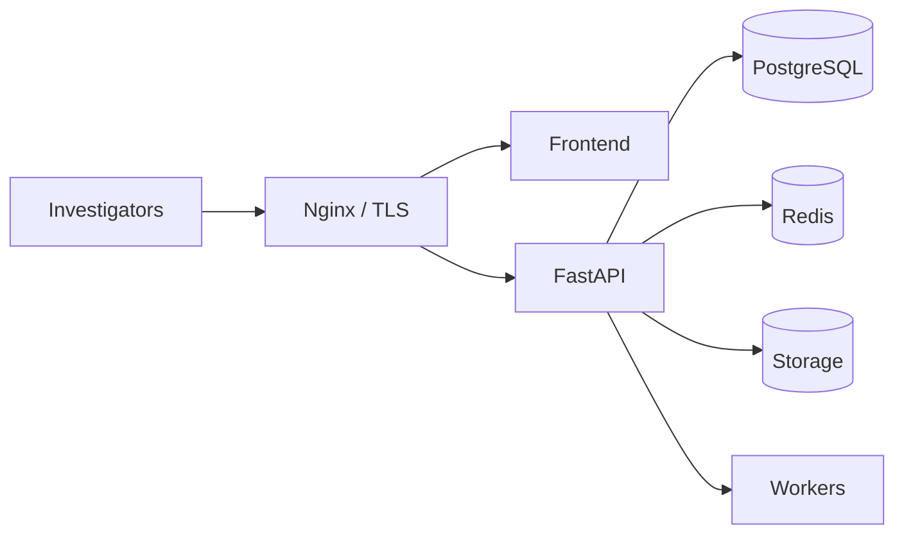

# AI-Forge

Enterprise multimodal **digital forensics and fraud intelligence** platform
for banks, insurers, forensic laboratories, law enforcement, and regulated
security teams.

[](.github/workflows/ci.yml)
[](LICENSE)
[](https://www.python.org/)
[](https://nodejs.org/)

Phases **1–10** are in this repository: case/evidence preservation, processing,
extraction, forensic and modality AI, fusion, correlation, reporting,
identity/RBAC, monitoring, production infrastructure, performance, security
hardening, scale, disaster recovery, CI/CD, and this documentation set.

The platform **does not** invent legal conclusions. Original evidence is
immutable. Missing capabilities are reported explicitly.

## Overview

Investigators create cases, upload evidence, run processing and AI analyses,
fuse multimodal findings, correlate events, reconstruct timelines, collaborate,
and generate provenance-bearing reports. Operators deploy a stateless API,
workers, PostgreSQL, Redis, and optional object storage behind TLS.

Full map: [docs/architecture-overview.md](docs/architecture-overview.md).

## Architecture

Clean Architecture backend (`backend/app/`) plus a React investigation SPA
(`frontend/`).



- [Backend](docs/backend-architecture.md)
- [Frontend](docs/frontend-architecture.md)
- [AI](docs/ai-architecture.md)
- [Database](docs/database-schema.md)

## Feature matrix

| Area | Capabilities |
| --- | --- |
| Cases & evidence | Numbered cases, SHA-256 originals, custody, allow-listed uploads |
| Processing | Deterministic jobs, derived hashed artifacts |
| Extraction | PDF/image/audio localization, optional OCR, no invented regions |
| Forensics & AI | Classic analysis, image/document/video/audio AI, signatures |
| Fusion | Deterministic multimodal jury, conflicts, assessments |
| Investigation | Correlation, entities, timeline, knowledge graph, intelligence |
| Reporting | Aggregated JSON/Markdown/HTML reports + download |
| Collaboration | Members, tasks, comments, workflow, case review |
| Security | JWT/RBAC, headers/CSP, rate limits, upload validation, audits |
| Operations | Health/readiness, monitoring, diagnostics, release-check |
| Scale & DR | HPA/workers, S3/Azure/GCS, backup/restore/verify |
| CI/CD | GitHub Actions quality gates, GHCR images, SemVer releases |

## Installation

Requirements: Python 3.12, [uv](https://docs.astral.sh/uv/), Node.js 22, Docker.

```bash
copy .env.example .env
uv sync --dev
docker compose up --build
```

API: `http://localhost:8000` — `GET /api/v1/health/live`.

Frontend:

```bash
cd frontend
npm ci
npm run dev
```

Without Compose:

```bash
uv run alembic -c backend/alembic.ini upgrade head
uv run uvicorn backend.app.main:app --reload
```

OpenAPI UI is at `/docs` when `DEBUG=true`. Setup details:
[docs/development.md](docs/development.md).

## Deployment

Production images: `deployment/docker/backend.Dockerfile` and
`frontend.Dockerfile`. Compose/Kubernetes/Nginx:
[docs/deployment-guide.md](docs/deployment-guide.md),
[docs/deployment.md](docs/deployment.md).

Publish path: tag `vMAJOR.MINOR.PATCH` matching `pyproject.toml`
([docs/release-engineering.md](docs/release-engineering.md)).

## Documentation index

Start at **[docs/README.md](docs/README.md)**.

| Topic | Document |
| --- | --- |
| Architecture | [architecture-overview.md](docs/architecture-overview.md) |
| API (every endpoint) | [api-reference.md](docs/api-reference.md) |
| Investigators | [investigator-guide.md](docs/investigator-guide.md) |
| Administrators | [administrator-guide.md](docs/administrator-guide.md) |
| Operations | [operations-guide.md](docs/operations-guide.md) |
| v1.0 checklist | [release-checklist.md](docs/release-checklist.md) |
| Release notes | [RELEASE_NOTES.md](RELEASE_NOTES.md) |
| Contributing | [docs/contributing.md](docs/contributing.md) |

## Screenshots

Capture these from a running workspace (do not commit real case data):

- Sign-in (`/login`)
- Investigations list and case workspace
- Evidence upload and processing status
- Fusion / jury and timeline panels
- Report download and monitoring dashboard

Place organizational screenshots in an internal runbook if you cannot publish
them in git.

## Roadmap

Completed in-tree: Phases 1–10H (foundation through enterprise documentation).

Possible future work (not implemented here): SSO/MFA, additional licensed
detectors, tenant isolation at million-analysis scale, and external SIEM
connectors. Extensions must keep inward dependencies and immutable originals.

## License

MIT. See [LICENSE](LICENSE).
