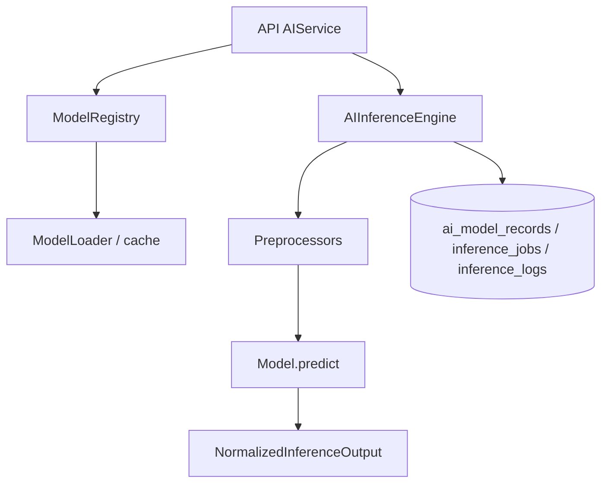
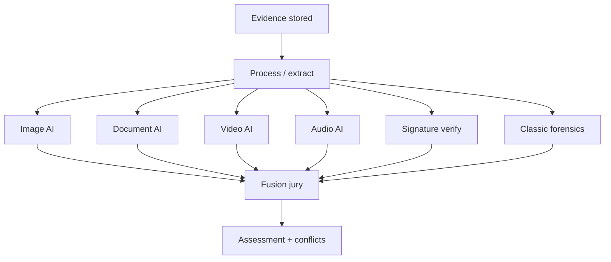

# AI architecture

AI-Forge separates **infrastructure** (registry, devices, jobs) from
**modality analysis** and **fusion**. Engines must not rewrite originals or
silently call each other.

Deep dives: [ai-model-infrastructure.md](ai-model-infrastructure.md),
[document-ai.md](document-ai.md), [video-ai.md](video-ai.md),
[audio-ai.md](audio-ai.md), [signature-verification.md](signature-verification.md),
[fusion-ai.md](fusion-ai.md).

## Registry and inference

`build_registry()` registers factories at startup. `DummyModel` exists for
infrastructure verification. Production detectors plug in via the same
contract (`AIEngine` / factory), not via edits to case/evidence use cases.

`POST /api/v1/models/reload` reloads a named model and records an inference
job. Listing is `GET /api/v1/models`.

## AI workflow (investigation)

Each modality POST queues a run (`202`). GET routes return history, findings,
and localized regions/segments/frames. Fusion reads **persisted** findings.

## Jury fusion

Six deterministic roles vote on normalized findings. Unavailable or
not-applicable modalities are excluded from negative scoring. Conflicts are
first-class records.

## Adding a module

1. Implement the engine contract and factory.
2. Register in bootstrap / registry — do not add `if model == ...` in
   application services.
3. Persist runs/findings in dedicated tables.
4. Expose versioned HTTP adapters under `api/v1/endpoints/`.
5. Add UI panel + typed client only if investigators need it.
6. Cover failure and unavailable-capability paths in tests.

See [development.md](development.md) and [coding-standards.md](coding-standards.md).

## What AI must not do

- Mutate original evidence bytes
- Invent coordinates, transcripts, or legal conclusions
- Re-run sibling engines inside fusion
- Treat missing models as proof of authenticity or fraud
