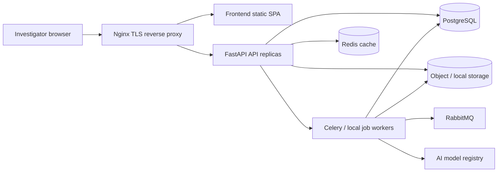
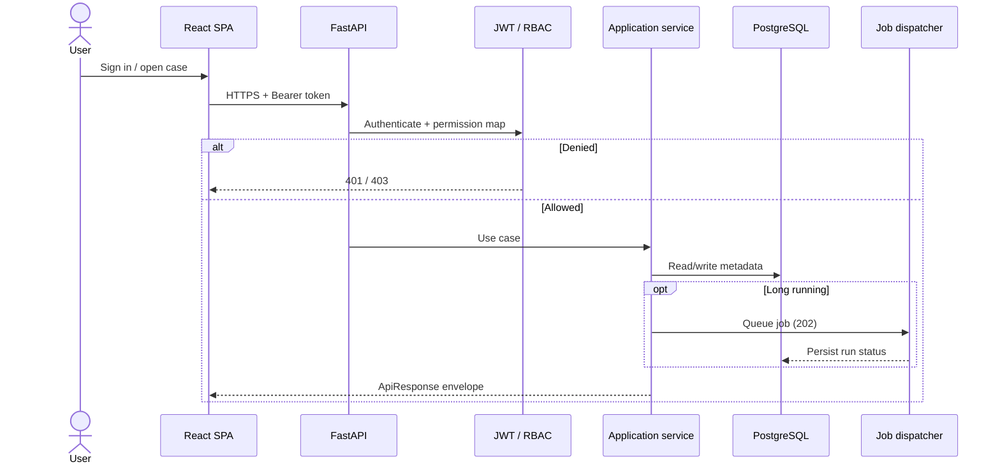
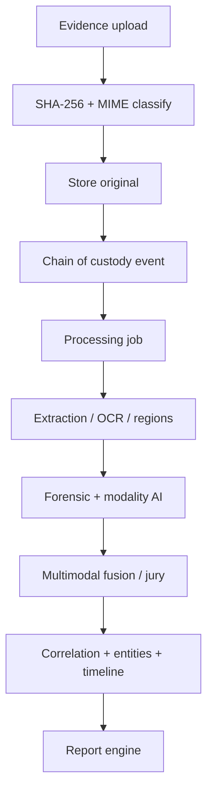
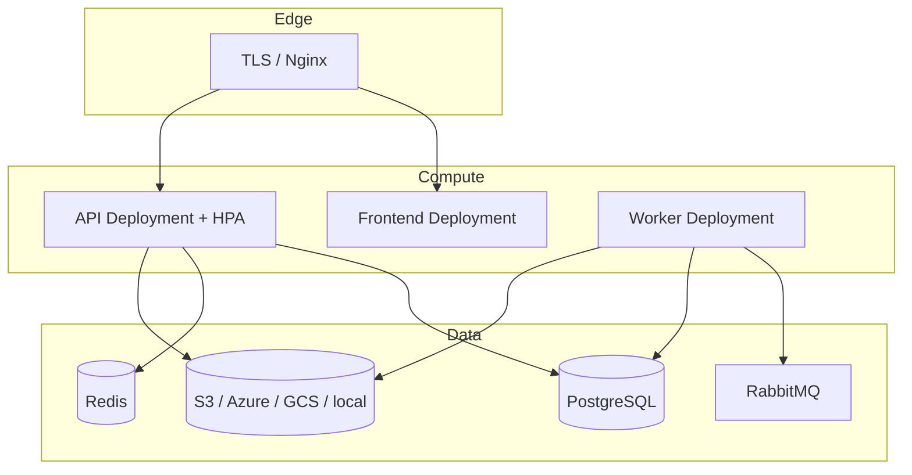
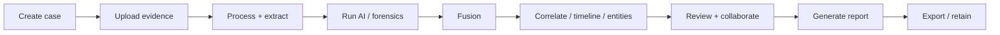

# Architecture overview

AI-Forge is a multimodal digital-forensics and fraud-intelligence platform.
The backend is a **Clean Architecture** FastAPI service. The frontend is a
Vite/React investigation workspace. Workers, object storage, PostgreSQL, Redis,
and RabbitMQ sit outside the request process.

Phase-specific deep dives remain in the original docs (for example
[processing-pipeline.md](processing-pipeline.md),
[fusion-ai.md](fusion-ai.md)). This page is the enterprise map.

## Clean Architecture

```text
HTTP (api/)  ──┐
               ├──► application/ (use cases) ──► domain/ (ports & types)
Celery/infra ──┘
```

| Layer | Location | May depend on |
| --- | --- | --- |
| Domain | `backend/app/domain/` | Nothing framework-specific |
| Application | `backend/app/application/` | Domain ports |
| Infrastructure | `backend/app/infrastructure/` | Domain + vendors |
| API | `backend/app/api/` | Application services |
| AI engines | `backend/app/ai/`, modality packages | Registry + domain contracts |

Dependencies point **inward**. New detectors register; they do not rewrite
orchestration.

## System architecture



## Request lifecycle



## Processing pipeline

Original bytes are **read-only**. Processing writes independently hashed
artifacts. Analysis never mutates the original object.



See [processing-pipeline.md](processing-pipeline.md) and
[backend-architecture.md](backend-architecture.md).

## AI orchestration

Models register in `ModelRegistry`. Inference jobs persist separately from
forensic findings. Modality analyzers (image, document, signature, video,
audio) and the fusion jury **consume stored findings**; they do not silently
re-run each other.

Details: [ai-architecture.md](ai-architecture.md),
[ai-model-infrastructure.md](ai-model-infrastructure.md).

## Multimodal fusion

Phase 6F normalizes findings, scores six deterministic jury roles, records
conflicts, and stores a fusion assessment. Unavailable modalities are not
treated as negative proof.

## Correlation engine

Case-scoped correlation links evidence items using persisted metadata and
findings. Entity resolution and the knowledge graph are adjacent, additive
read models.

## Reporting engine

The report generator **aggregates** existing snapshots (no new AI). Output
formats include JSON, Markdown, HTML, and downloadable artifacts with
provenance checksums.

## Deployment topology



See [deployment-guide.md](deployment-guide.md) and
[scalability.md](scalability.md).

## Investigation workflow



User steps: [investigator-guide.md](investigator-guide.md).
