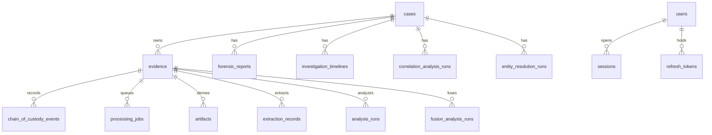

# Database schema

PostgreSQL is the system of record for investigation **metadata**. Evidence
**bytes** live in object/local storage; tables store hashes, paths, and
custody. Schema changes go through Alembic only.

Current expected head: `20260915_0034` (see
`backend/app/deployment/release.py`).

## Core investigation graph



## Identity and access

| Table | Purpose |
| --- | --- |
| `users` | Accounts |
| `roles` / `permissions` | RBAC |
| `sessions` / `refresh_tokens` | JWT session lifecycle |
| `security_roles` / `security_permissions` | Governance catalog |
| `case_access_records` | Per-case access |
| `policy_violations` / `compliance_reports` | Policy outcomes |

## Evidence and processing

| Table | Purpose |
| --- | --- |
| `cases` | Investigation container (`case_number` unique) |
| `evidence` | Immutable original metadata, SHA-256, MIME, storage key |
| `chain_of_custody_events` | Custody log |
| `processing_jobs` / `artifacts` | Derived objects with independent hashes |
| `extraction_records` | Localization / OCR provenance |
| `reference_evidence` / `comparison_runs` / `differences` | Reference compare |

Unique `(case_id, sha256_hash)` prevents silent duplicate originals in a case.

## Analysis products

| Family | Tables |
| --- | --- |
| Classic forensics | `analysis_runs`, `findings`, `finding_regions` |
| Image / document / video / audio AI | `*_analysis_runs`, `*_ai_findings`, `*_ai_finding_regions` |
| Signature | `signature_verification_runs` |
| Fusion | `fusion_analysis_runs`, `jury_assessment_records`, `fusion_conflict_records` |
| Timeline | `investigation_timelines`, `timeline_events`, `timeline_conflicts` |
| Correlation | `correlation_analysis_runs`, `evidence_correlations`, `correlation_support_records` |
| Entities | `entity_resolution_runs`, `investigation_entities`, `entity_relationships` |
| Knowledge graph | `knowledge_graph_runs`, `graph_entities`, `graph_relationships`, aliases, provenance |
| Case intelligence | `case_intelligence_runs` and related relationship/conflict/timeline records |
| Reports | `forensic_reports` |

## Collaboration, workflow, audit

`case_members`, comments, tasks, reviews, notifications, `activity_log`,
investigation workflow tables, `audit_events`, monitoring snapshots,
integrity/analytics/platform-validation run tables.

## Relationships (logical)

- **Case 1—N Evidence**. Deleting a case cascades owned evidence in ORM
  configuration; production deletes remain an explicit operational policy.
- **Evidence 1—N jobs/runs**. Analysis rows point at evidence, never rewrite
  it.
- **Users N—M Roles—Permissions**. Enforcement is server-side on each HTTP
  call.
- **Reports** snapshot investigation products at generation time.

## Migrations

```bash
uv run alembic -c backend/alembic.ini upgrade head
uv run alembic -c backend/alembic.ini current
uv run alembic -c backend/alembic.ini heads
```

CI fails if more than one head exists or the head is not the expected
revision. Additive, backward-compatible migrations only unless a release
explicitly documents a break.

See [development.md](development.md) and
[release-engineering.md](release-engineering.md).
