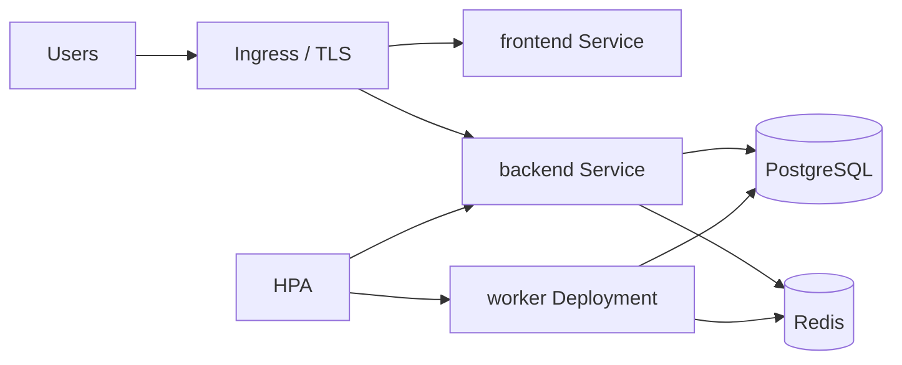

# Deployment guide

How to install and ship AI-Forge. Manifests and env validation:
[deployment.md](deployment.md). CI images:
[release-engineering.md](release-engineering.md).

## Prerequisites

- Python 3.12 and [uv](https://docs.astral.sh/uv/)
- Node.js 22 (frontend)
- Docker / Docker Compose
- PostgreSQL 16+, Redis 7+, RabbitMQ (when using Celery)
- Optional: Kubernetes 1.28+, object storage (S3/Azure/GCS)

## Local (development)

```bash
copy .env.example .env
uv sync --dev
docker compose up --build
```

API: `http://localhost:8000`  
Frontend (separate): `cd frontend && npm install && npm run dev`

Migrations run via the Compose `migrate` service, or:

```bash
uv run alembic -c backend/alembic.ini upgrade head
uv run uvicorn backend.app.main:app --reload
```

## Production Compose

1. Copy `.env.production.example` → `.env.production`.
2. Set `JWT_SECRET`, database, Redis, storage, and image tags.
3. `deployment/scripts` production start/stop/migrate as documented in
   [deployment.md](deployment.md).
4. Nginx terminates TLS (`deployment/nginx/`).

Images:

- `deployment/docker/backend.Dockerfile`
- `deployment/docker/frontend.Dockerfile`

GHCR tags: `latest`, SemVer, 12-character SHA.

## Kubernetes

Manifests under `deployment/k8s/` include API, workers, HPA/PDB, Postgres,
Redis, and Ingress. Size pools using [scalability.md](scalability.md).



## After deploy

1. `GET /api/v1/system/liveness`
2. `GET /api/v1/system/readiness`
3. `POST /api/v1/system/release-check` (operator with `system.monitor`)

Rollback: previous image tags; restore DB only if migrations are
incompatible. See [operations-guide.md](operations-guide.md).
