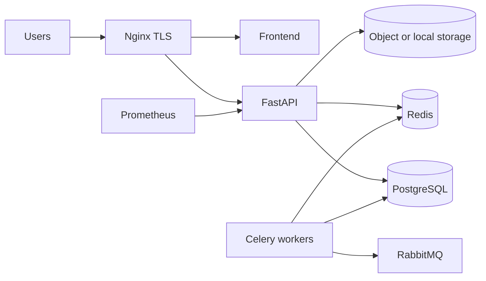

# Deployment guide

How to install and ship AI-Forge. Manifests and env validation:
[deployment.md](deployment.md). CI images:
[release-engineering.md](release-engineering.md).
Administrator operations: [administrator-guide.md](administrator-guide.md).

## Prerequisites

- Python 3.12 and [uv](https://docs.astral.sh/uv/)
- Node.js 22 (frontend)
- Docker / Docker Compose
- PostgreSQL 16+, Redis 7+, RabbitMQ (when using Celery)
- Optional: Kubernetes 1.28+, object storage (S3/Azure/GCS)

## Local (development)

```bash
copy .env.example .env
uv sync --dev
docker compose up --build
```

API: `http://localhost:8000`  
Frontend (separate): `cd frontend && npm ci && npm run dev`

Vite proxies `/api` to the API. OpenAPI UI is at `/docs` only when
`DEBUG=true`.

Migrations run via the Compose `migrate` service, or:

```bash
uv run alembic -c backend/alembic.ini upgrade head
uv run uvicorn backend.app.main:app --reload
```

## Docker Compose (development stack)

Root `docker-compose.yml` starts API, frontend, PostgreSQL, Redis, and related
services. Copy `.env.example` first. Default database credentials in that
file are **local placeholders** — replace them before any shared environment.

## Production environment

Recommended topology:



1. Copy `.env.production.example` → `.env.production`.
2. Set `JWT_SECRET`, database, Redis, storage, and image tags.
3. `DEBUG=false`, `APP_ENV=production`.
4. Use `deployment/scripts` production start/stop/migrate as documented in
   [deployment.md](deployment.md).
5. Terminate TLS at Nginx (`deployment/nginx/nginx-tls.conf.example`) with
   HTTP→HTTPS redirect and `limit_req` on `/api/`.
6. Scrape metrics from the API service, not the public `/api/v1/metrics`
   vhost (returns 404 by design after RC3).

Images:

- `deployment/docker/backend.Dockerfile` (non-root `appuser`)
- `deployment/docker/worker.Dockerfile` (Celery)
- `deployment/docker/frontend.Dockerfile`

GHCR tags: `latest`, SemVer, 12-character SHA.

## Reverse proxy and HTTPS

- Edge: `deployment/nginx/nginx.conf` plus TLS overlay.
- SPA container: `deployment/nginx/frontend.conf`.
- `client_max_body_size` must meet `MAX_UPLOAD_SIZE_MB`.
- Security headers and HSTS are in the TLS example and SPA location blocks.

## Database, Redis, RabbitMQ, workers

- PostgreSQL is the system of record; least-privilege app user (no superuser).
- Redis: cache and optional rate-limit / Celery result backend.
- RabbitMQ: Celery broker when workers are enabled.
- Worker image matches the API codebase; scale independently.

## Kubernetes

Manifests under `deployment/k8s/` include API, workers, HPA/PDB, Postgres,
Redis, and Ingress. Size pools using [scalability.md](scalability.md).

## After deploy

1. `GET /api/v1/system/liveness`
2. `GET /api/v1/system/readiness`
3. `POST /api/v1/system/release-check` (operator with `system.monitor`)

Rollback: previous image tags; restore DB only if migrations are
incompatible. See [operations-guide.md](operations-guide.md) and
[known-limitations.md](known-limitations.md).
