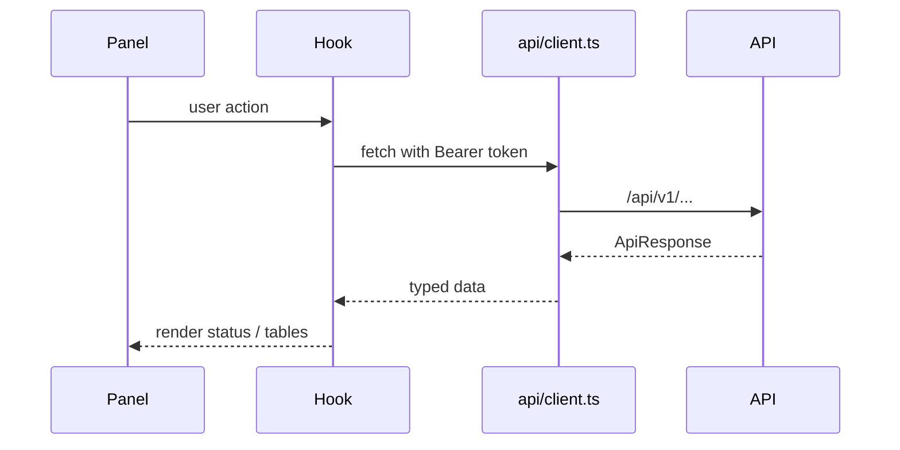

# Frontend architecture

Vite + React + TypeScript investigation workspace in `frontend/`.

The UI **displays server state**. It does not run forensic detectors, invent
hashes, or store evidence bytes.

## Stack

| Piece | Role |
| --- | --- |
| Vite 8 | Dev server, production bundle |
| React 19 | UI |
| React Router | Routes in `src/routes/AppRoutes.tsx` |
| TanStack Query | Server cache |
| Tailwind CSS | Layout |
| Vitest + Testing Library | Tests |

API base: `VITE_API_BASE_URL` (default relative `/api/v1`). Dev proxy: Vite
forwards `/api` to the backend.

## Route map

| Path | Page | Guard |
| --- | --- | --- |
| `/login` | Login | Public |
| `/dashboard` | Dashboard | Authenticated |
| `/investigations` | Case list | Authenticated |
| `/investigations/:caseId` | Workspace | Authenticated |
| `/evidence` | Evidence | Authenticated |
| `/reports` | Reports | Authenticated |
| `/analytics` | Analytics | `analytics.view` |
| `/platform-health` | Platform health | `platform_validation.view` |
| `/settings`, `/profile` | User settings | Authenticated |
| `/system`, `/deployment`, `/monitoring` | Ops | `system.monitor` |
| `/users` | User admin | `admin.manage_users` |
| `/security` | Governance | `security.view` |
| `/interoperability` | Export/import | `interop.export` |
| `/ai-models` | Model registry | Authenticated |
| `/unauthorized` | Denied | Authenticated |

Routes are lazy-loaded. `ProtectedRoute` restores the JWT session;
`RoleGuard` hides pages the principal cannot use. The API still enforces
permissions.

## Investigation workspace

`InvestigationWorkspacePage` hosts panels (processing, extraction, forensics,
image/document/video/audio AI, fusion jury, correlation, timeline, reports,
collaboration, workflow, integrity, and related intelligence). Each panel
talks to a typed client under `src/services/api/`.

## Data flow



Tokens live in `tokenStore`. The client attaches `Authorization` and surfaces
envelope errors without fabricating records.

## Quality

```bash
cd frontend
npm ci
npm test
npm run build
npm run lint
```

See [development.md](development.md) and `frontend/README.md`.
