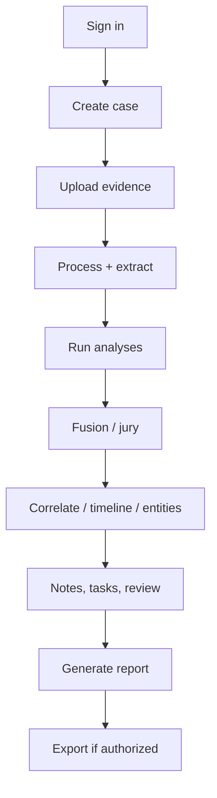

# Investigator guide

How to work a case in the AI-Forge workspace. The UI never invents hashes,
findings, or legal conclusions. Full user manual: [user-guide.md](user-guide.md).
Methodology: [forensic-methodology.md](forensic-methodology.md).

## Sign in

Open `/login`. Use your assigned username and password. Access tokens expire
(~15 minutes); the client refreshes them. Use **Sign out** to revoke the
session.

If you see `/unauthorized`, you lack the permission for that page. Ask an
administrator — do not share accounts.

## Case creation

1. Open **Investigations**.
2. Create a case with title, optional description, and priority.
3. The server assigns `case_number` (for example `CASE-000001`).
4. Open the case to reach `/investigations/:caseId`.

API: `POST /api/v1/cases` — see [api-reference.md](api-reference.md).

## Evidence upload

Use the workspace upload control or **Evidence**. Originals are hashed
(SHA-256) and stored read-only. Duplicate hash in the same case is rejected.
Supported types follow the server allow-list (images, PDF/DOCX, common
video/audio). Details: [evidence-management.md](evidence-management.md).

## Processing and extraction

Queue **process** then **extract**. Wait for job status. Previews and OCR
regions are derived artifacts with their own hashes. Missing OCR/runtime
capabilities are reported as unavailable — not as empty fraud.

## AI analysis

From the case workspace, run forensic analysis and modality AI (image,
document, video, audio, signature) as needed. Each run is queued (`202`) and
listed in history. Interpret findings with [ai-analysis-guide.md](ai-analysis-guide.md).

## Multimodal fusion

After modality results exist, run fusion. The jury **does not** re-analyze
pixels/audio. It combines stored findings and records conflicts.

## Correlation, entities, timeline

Run correlation, entity resolution, and timeline from the case. These are
case-scoped reconstructions from existing data.

## Collaboration and review

Members, comments, tasks, workflow, and case review panels support human
process. Approvals are explicit investigator/reviewer actions.

## Reports and exports

Generate a report after the investigation products you need exist. Download
from **Reports**. Package export is on **Interoperability** if you have
`interop.export`. See [reporting-guide.md](reporting-guide.md).

## What not to do

- Do not treat model unavailability as authenticity.
- Do not delete originals to “clean up” a case.
- Do not paste credentials into comments.
